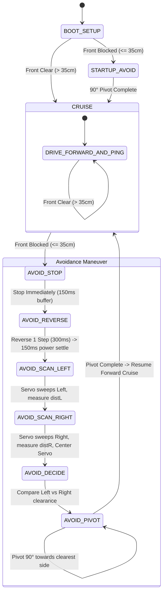

# Arduino 4WD Obstacle Avoiding Robot

An autonomous 4-wheel drive (4WD) obstacle-avoiding robot powered by an **Arduino Uno**, **HC-SR04 ultrasonic distance sensor** mounted on an **SG90 servo**, and an **L298N dual H-bridge motor driver** with a **3S 18650 Li-ion battery pack (11.1V)**.

---

## 📸 Hardware Overview

- **Microcontroller**: Arduino Uno (ATmega328P)
- **Chassis**: 4WD robot platform with 4x DC yellow TT gear motors
- **Motor Driver**: L298N Dual H-Bridge Module
- **Distance Sensor**: HC-SR04 Ultrasonic Sensor
- **Sensor Pan Mechanism**: TowerPro SG90 9g Micro Servo
- **Power Supply**: 3S 18650 Li-ion battery pack (3x 3.7V = 11.1V nominal, ~12.6V fully charged)
- **Status Indicator**: Onboard Pin 13 LED (used as boot countdown & brownout reset indicator)

---

## 🔌 Pin Mapping

| Component | Pin Function | Arduino Uno Pin |
|---|---|---|
| **SG90 Servo** | Signal (PWM) | `Pin 3` |
| **HC-SR04** | Trigger | `Pin 11` |
| **HC-SR04** | Echo | `Pin 12` |
| **L298N Driver** | ENA (Left Speed PWM) | `Pin 5` |
| **L298N Driver** | IN1 (Left Motor Dir 1) | `Pin 7` |
| **L298N Driver** | IN2 (Left Motor Dir 2) | `Pin 8` |
| **L298N Driver** | ENB (Right Speed PWM) | `Pin 6` |
| **L298N Driver** | IN3 (Right Motor Dir 1) | `Pin 9` |
| **L298N Driver** | IN4 (Right Motor Dir 2) | `Pin 10` |
| **Status LED** | Onboard LED | `Pin 13` |

---

## 🧠 Behavior & State Machine Logic

The robot operates on a non-blocking state machine implemented in [`obstacle-robot.ino`](./obstacle-robot.ino):



### 1. Safety Boot Countdown & Reset Indicator
On power-up or reset, the onboard Pin 13 LED double-blinks for **3 seconds** (`3... 2... 1...`) while the robot remains stationary. This provides time to place the robot safely on the floor and acts as an immediate visual detector for electrical brownout resets.

### 2. Startup Obstacle Check
- The servo points forward (`90°`) and measures the front distance.
- **Front Clear (> 35 cm)**: Enters cruise mode immediately without delay.
- **Front Blocked (≤ 35 cm)**: Scans Left and Right, determines which side has greater clearance, executes a 90° pivot, and begins cruise.

### 3. Continuous Cruise (Simultaneous Drive & Sense)
- All 4 motors drive forward (`PWM 135` calibrated for 3S 11.1V).
- The HC-SR04 pings the front every **60 ms** continuously while motors run.
- The servo remains fixed facing forward.

### 4. Immediate Obstacle Avoidance Loop
When an obstacle is detected within 35 cm:
1. **Instant Stop**: Motors cut immediately (`motors_stop()`) to avoid collision and eliminate motor electrical noise.
2. **Reverse 1 Step**: Motors reverse for 300 ms (`SPEED_REV = 130`), followed by a 150 ms power stabilization buffer.
3. **Scan Sides**: Servo sweeps Left (`distL`) and Right (`distR`), using median filtering for accuracy.
4. **Decide & Pivot 90°**: Compares clearance and executes a 90° pivot towards the clearer side (`TURN_90_MS = 950 ms`).
5. **Resume Forward**: Immediately resumes forward cruise.

---

## 🛠️ Current Engineering Discussion: Electrical Brownout Resets

When tested on the floor under load, the Arduino reboots due to motor current draw pulling down the 5V line.

### Observations:
- In the air (wheels free), the robot performs perfectly with no resets.
- On the floor under tire friction, the Arduino's Pin 13 LED re-triggers the 3-second startup countdown repeatedly.
- The power source is a 3S Li-ion pack (11.1V–12.6V).
- The Arduino is currently powered from the L298N module's onboard 5V linear regulator (78M05).

### Proposed Solutions Under Review:
1. **Connect Battery to Arduino `VIN` Pin**:
   Move the positive feed from the battery to the Arduino's `VIN` pin instead of the `5V` pin. The Arduino Uno's onboard regulator (AMS1117/NCP1117) accepts 7V–12V and operates independently of the L298N's 5V chip.
2. **Separate Power for Arduino / Logic**:
   Power the Arduino Uno and servo via a 5V USB power bank or dedicated battery, keeping a common ground (GND) with the motor driver.
3. **Decoupling Capacitors**:
   - Add a 470µF – 1000µF electrolytic capacitor across the 5V and GND rails.
   - Solder 0.1µF (104) ceramic capacitors across the motor terminals to suppress brush commutation noise.

---

## 📂 Repository Structure

```
├── obstacle-robot.ino    # Main robot firmware
├── motor-test/
│   └── motor-test.ino    # Basic motor driver test sketch
└── README.md             # Project documentation & schematics
```

---

## 🚀 Compiling and Uploading

Using the [Arduino CLI](https://arduino.github.io/arduino-cli/):

```bash
# Compile for Arduino Uno
arduino-cli compile --fqbn arduino:avr:uno obstacle-robot.ino

# Upload to Arduino
arduino-cli upload -p /dev/ttyUSB0 --fqbn arduino:avr:uno obstacle-robot.ino
```
